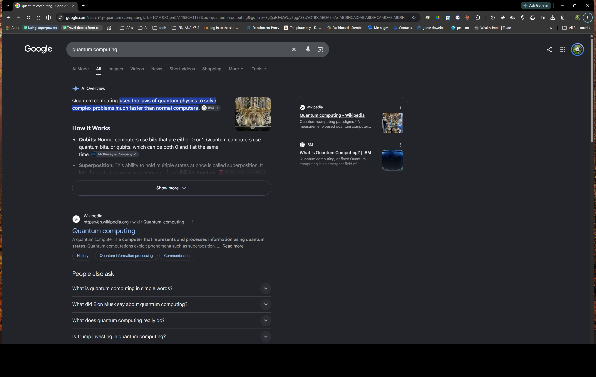
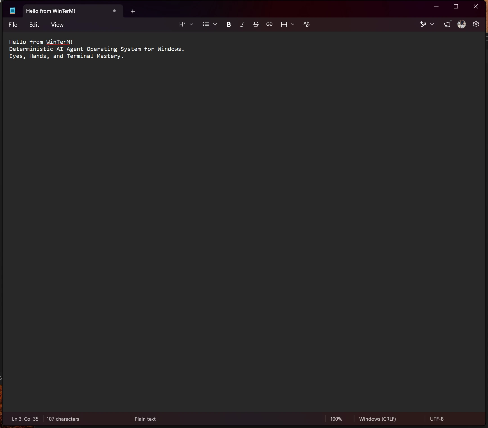

# WinTerM: The AI Agent Operating System for Windows & Linux/WSL

[](https://github.com/shiva2321/WinTerM)
[](https://microsoft.com)
[](https://python.org)
[](docs/PROOFS_AND_BENCHMARKS.md)
[](docs/MCP_TOOLS.md)
[](GEMINI.md)
[](CLAUDE.md)
[](DEEPSEEK.md)
[](winterm/subsystems/linux_subsystem.py)
[](LICENSE)

**WinTerM equips autonomous AI agents with Eyes, Hands, and Terminal Mastery on Windows and Linux/WSL2.**

Most AI agents struggle on Windows because they operate as blind shell wrappers — they crash on PowerShell quoting quirks, freeze on interactive prompts, cannot see graphical applications, and cannot click or type without breaking modern Windows apps.

**WinTerM fundamentally solves this.** It gives any AI model (Claude, Gemini, DeepSeek, GPT-4, Llama) deterministic control over the entire operating system: executing terminal commands safely, launching desktop software, clicking buttons, typing text, and extracting everything visible on screen with zero third-party dependencies.

---

## 📸 Real-World Proofs & Live Telemetry

WinTerM is tested and verified directly on live Windows 11 environments with zero external browser drivers, web wrappers, or third-party OCR libraries.

### Proof 1: Autonomous Chrome Search & Screen Perception
WinTerM opened Google Chrome via OS keyboard simulation (`Win+R`), latched onto the window (`HWND 789800`), activated the search bar (`Ctrl+L`), submitted the query `"quantum computing breakthroughs 2026"`, smoothly scrolled through the viewport, and parsed 65 lines of search results using **WinRT Native OCR**:



```text
Extracted Directly via WinTerM Native OCR:
• AI Overview: "Quantum computing uses the laws of quantum physics to solve complex problems..."
• Qubits: "Normal computers use bits that are either 0 or 1. Quantum computers use qubits..."
• Wikipedia Card: "Quantum computing - Wikipedia - https://en.wikipedia.org > wiki > Quantum_computing"
• People Also Ask: "What is quantum computing in simple words?", "What does quantum computing really do?"
• IBM Card: "What Is Quantum Computing? | IBM"
```


### Proof 2: Autonomous Text Typing in Modern WinUI3 Notepad
Legacy automation tools crash the modern Windows 11 Notepad because of unsupported `keybd_event` unicode flags. WinTerM uses hardware-accurate Win32 `SendInput` on a verified desktop thread with automatic clearing and Set-of-Mark feedback:



### Proof 3: Cognitive Screen Mental Map & Dynamic Attention
WinTerM maintains an internal 5-layer spatial hierarchy (`Desktop`, `Inactive Windows`, `Active Workspace`, `Modals & Dialogs`, `Functional Zones`) and scores real-time Action Affordances so AI models have continuous cognitive focus:


*(For full execution logs, benchmarks, and data, see the [Proofs & Benchmarks Document](docs/PROOFS_AND_BENCHMARKS.md)).*

---

## ⚡ Key Capabilities at a Glance

| Pillar | What WinTerM Gives the Agent | Why It Matters |
| :--- | :--- | :--- |
| **👀 The Eyes** *(Perception)* | • **Cognitive Screen Mental Map**: Persistent 5-layer spatial model (`Desktop`, `Inactive Windows`, `Active Workspace`, `Modals`, `Functional Zones`) with prioritized Action Affordances.<br>• **WinRT Native OCR**: Extracts text from any window with zero Python/C++ dependencies.<br>• **Set-of-Mark (SoM)**: Overlays high-contrast numbered badges (`[1]`, `[2]`, `[3]`) for vision models.<br>• **UIAutomation Tree**: Deep semantic inspection of buttons, edit boxes, and menus.<br>• **Visual Change Detection**: Waits for page loads and transitions without brittle sleeps. | The agent understands what is on screen across spatial layers and functional zones, with clear attention on what to do next. |
| **✋ The Hands** *(Action)* | • **Natural Mouse Movement**: Smooth cubic Bezier curves with randomized control point offsets to prevent bot detection.<br>• **Element Hovering**: Dwells over buttons, toolbars, or coordinates to trigger dynamic hover menus and preview cards.<br>• **Calibrated Viewport Scrolling**: Centers off-screen elements cleanly into view via calculated wheel ticks.<br>• **Focus-Verified Typing with Auto-Clear**: Synchronized `Ctrl+A` + `Backspace` before safe Unicode typing.<br>• **Verified Window Focus & Window-Contained Clicks**: Locks foreground desktop and validates `WindowFromPoint` containment. | The agent interacts with apps just like a human operator, with fluid natural motion and zero misclicks or corrupted inputs. |
| **💻 Terminal Mastery** *(Shell)* | • **PowerShell 5.1/7 & CMD**: Automatic quoting, call operator `&`, execution policy handling.<br>• **Linux & WSL2 Dual-Stack**: Automatic bidirectional path translation (`C:\...` $\leftrightarrow$ `/mnt/c/...`).<br>• **Non-Interactive Guards**: Injects `-Force` and `-Confirm:$false` to prevent headless agent hangs.<br>• **Deterministic Safety Gate**: Blocks dangerous commands (`rm -rf /`, `diskpart`, `Format-Volume`) by default. | The agent never hangs waiting for user input and cannot accidentally destroy system files. |
| **🧠 Cognitive Brain** *(5W Pipeline)* | • **WHAT**: Decomposes natural language goals into staged execution steps.<br>• **HOW**: Strict command synthesis for the specific active shell.<br>• **WHEN**: State guards and idempotency checks (skips already-satisfied states).<br>• **WHY**: Semantic explanation of why switches were chosen and alternatives rejected.<br>• **AFTER**: Pre-execution blast radius simulation, state diffing, rollback undo, and error healing. | The agent understands *why* it is running a command, *what* will change, and *how* to undo or self-heal errors. |
| **🐝 Multi-Agent Swarm** *(Coordination)* | • **Shared Message Board**: Agents post directives and progress updates to an async blackboard.<br>• **Scoped Privileges**: Restricts sub-agents (`READ_ONLY_AUDIT`, `UI_OPERATOR`, `TERMINAL_EXECUTOR`).<br>• **Fluke Containment**: Isolated circuit breakers ensure one sub-agent's error never crashes the main agent. | Multiple AI models (Gemini, Claude, DeepSeek) can work together on the same PC without fighting over windows. |

---

## 🚀 3-Minute Quick Start

### 1. Installation
Clone the repository and install in editable mode:
```powershell
git clone https://github.com/shiva2321/WinTerM.git
cd WinTerM
pip install -e .
```

### 2. Connect to Your AI Agent (Model Context Protocol)
WinTerM exposes **54 production tools** via standard MCP. Add this to your agent configuration:

#### For Claude Code (`~/.claude/mcp.json` or `claude mcp add`):
```json
{
  "mcpServers": {
    "winterm": {
      "command": "python",
      "args": ["-m", "winterm.tools.mcp_server"]
    }
  }
}
```

#### For Google Antigravity / Gemini CLI (`mcp_config.json`):
```json
{
  "mcpServers": {
    "winterm": {
      "command": "python",
      "args": ["-m", "winterm.tools.mcp_server"]
    }
  }
}
```

#### For Cursor / Windsurf (`mcp.json`):
```json
{
  "mcpServers": {
    "winterm": {
      "command": "python",
      "args": ["-m", "winterm.tools.mcp_server"]
    }
  }
}
```

### 3. Use Directly from the Terminal (`winterm` CLI)
WinTerM includes an interactive command-line interface:

```powershell
# Inspect your Windows environment and capabilities
winterm info

# Plan a task with the 5W cognitive engine
winterm plan "Find what process is using port 8080 and stop it"

# Execute a task safely with dry-run simulation
winterm run "Query top 5 memory processes" --dry-run

# Read all text off any application screen using native OCR
winterm ui ocr 789800

# Focus a window and bring it to foreground
winterm window focus 789800

# Type text into the active window
winterm input type "Hello from WinTerM"
```

### 4. Use as a Python SDK
```python
from winterm.agent.winterm_agent import WinTermAgent

agent = WinTermAgent()

# Plan and execute a goal with autonomous verification
result, verif, trace = agent.run("Query network configuration")
print(result.stdout)

# Extract text from a window using hardware-accelerated WinRT OCR
ocr_result = agent.ocr_window("Chrome")
for line in ocr_result.get("lines", []):
    print(line["text"])
```

---

## 📚 Complete Documentation Hub

For deep architectural guides, API schemas, and manuals, explore the `docs/` directory:

| Document | Description |
| :--- | :--- |
| **[Documentation Index](docs/README.md)** | Overview and navigational guide across all documentation. |
| **[Architecture & Engine](docs/ARCHITECTURE.md)** | Complete 10-layer architecture, 5W cognitive model, and execution engine. |
| **[54 MCP Tools Reference](docs/MCP_TOOLS.md)** | Detailed reference for all 54 tools with parameter schemas and JSON examples. |
| **[CLI Reference Guide](docs/CLI_REFERENCE.md)** | Complete syntax and options for all `winterm` commands. |
| **[UI Perception & Actions Guide](docs/UI_PERCEPTION_AND_ACTIONS.md)** | Deep dive into WinRT OCR, Set-of-Mark visual grounding, Screen Mental Map, and input safety. |
| **[Proofs & Benchmarks](docs/PROOFS_AND_BENCHMARKS.md)** | Real-world execution logs, autonomous Chrome/Notepad proofs, and test metrics. |

---

## 🤖 Native Agent Integration Manuals

WinTerM provides specialized, first-class configuration manuals for leading agent frameworks:
- **[AGENTS.md](AGENTS.md)**: Universal autonomous operating protocol (Sense $\rightarrow$ Decide $\rightarrow$ Act $\rightarrow$ Verify).
- **[CLAUDE.md](CLAUDE.md)**: Native instructions for Claude Code and custom skills.
- **[GEMINI.md](GEMINI.md)**: Native instructions for Google Gemini / Antigravity multimodal vision.
- **[DEEPSEEK.md](DEEPSEEK.md)**: Native instructions for DeepSeek-R1 CoT reasoning tokens.
- **[OPENCODE.md](OPENCODE.md)**: Native instructions for local open-source agent execution.

---

## 🧪 Test Suite & Reliability Benchmarks

WinTerM is tested against a rigorous automated test suite covering unit logic, integration flows, CLI commands, and safety gates:

```text
============================= 182 passed in 21.19s =============================
```
- **Total Tests**: 182 passed / 0 failed (100% pass rate).
- **Knowledge Graph Density**: 10,374 nodes and 5,675 edges defending against hallucinated parameters across 144+ Windows binaries and cmdlets.
- **Safety Guarantee**: High-destructive commands (`Remove-Item` on system roots, `Format-Volume`, `diskpart`, `Stop-Computer`) are intercepted and rejected by default unless explicitly confirmed.

---

## 📄 License & Contributing

- **Contributing**: Contributions, bug reports, and feature proposals are welcome! Please read [CONTRIBUTING.md](CONTRIBUTING.md) and [CODE_OF_CONDUCT.md](CODE_OF_CONDUCT.md).
- **Roadmap**: See [ROADMAP.md](ROADMAP.md) for upcoming milestones and future subsystem layers.
- **License**: Source-available with commercial permission required. See [LICENSE](LICENSE) for terms.
