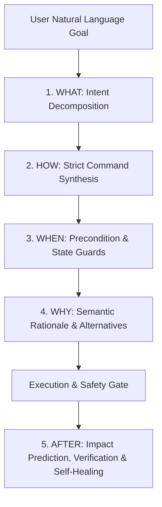

# WinTerM Architecture: The Operating System Substrate for AI Agents

WinTerM provides autonomous AI models with full operating system mastery on Windows and Linux/WSL2. Unlike fragile shell wrappers or coordinate-blind clickers, WinTerM operates as a deterministic, cognitive substrate across terminal execution, desktop GUI interaction, and multi-agent coordination.

---

## 1. The Core Paradigm: Eyes, Hands, and Brain

```
                  ┌────────────────────────────────────────┐
                  │    ANY AI Model / Agent Framework     │
                  │  (Claude, Gemini, DeepSeek, GPT-4...)  │
                  └───────────────────┬────────────────────┘
                                      │ MCP Tools / CLI / SDK
                                      ▼
┌───────────────────────────────────────────────────────────────────────────────┐
│                           W I N T E R M                                       │
├───────────────────────────────┬───────────────────────────────┬───────────────┤
│           👀 EYES             │           ✋ HANDS            │   🧠 BRAIN    │
│  (Perception & Grounding)     │     (Action & Execution)      │  (Cognition)  │
├───────────────────────────────┼───────────────────────────────┼───────────────┤
│ • Zero-dep WinRT Native OCR   │ • Unicode SendInput Typing    │ • 5W Pipeline │
│ • Set-of-Mark (SoM) Badges    │ • Modifier Hotkeys (Win, Ctrl)│ • Blast Radius│
│ • Full DPI Screen Capture     │ • Window-Contained Mouse Click│ • Error Remedy│
│ • UIAutomation Tree Inspect   │ • App Launch & Lifecycle      │ • Playbooks   │
│ • Visual Change Detection     │ • Window Focus/Restore/Resize │ • Undo Ledger │
└───────────────────────────────┴───────────────────────────────┴───────────────┘
                                      │
                                      ▼
┌───────────────────────────────────────────────────────────────────────────────┐
│                           WINDOWS ENVIRONMENT                                 │
│  PowerShell 5.1/7 • CMD • WSL2 Linux • Win32 • WPF • UWP • Chromium/Electron  │
└───────────────────────────────────────────────────────────────────────────────┘
```

---

## 2. The 5W Cognitive Model

Every action proposed or executed by an agent in WinTerM passes through an epistemological 5W cognitive pipeline:



### 1. WHAT to Do (`TerminalPlanner`)
Decomposes high-level natural language goals into an ordered Directed Acyclic Graph (DAG) of atomic `PlanStep` tasks.

### 2. HOW to Do (`CommandSynthesizer`)
Synthesizes deterministic terminal syntax for the specific target shell (PowerShell 5.1, PowerShell 7 Core, or CMD):
- **Space Quoting & Call Operator (`&`)**: Ensures executable paths with spaces never split.
- **Parenthesized Conditionals**: Fixes PowerShell logical traps (`if ((Test-Path a) -or (Test-Path b))`).
- **UTF-8 Byte Stream Integrity**: Prevents byte truncation across legacy OEM code pages.
- **Non-Interactive Injection**: Automatically injects `-Force`, `-Confirm:$false`, and non-interactive switches to prevent headless agent sessions from hanging.

### 3. WHEN to Do (`PreconditionScheduler`)
Evaluates system state guards and idempotency checks before touching the system. If the desired state is already satisfied (e.g. port already open, service already running), the step is safely bypassed.

### 4. WHY to Do (`SemanticReasoner`)
Generates transparent semantic rationale explaining why a command, switch, or method was selected, and why alternative cmdlets or tools were rejected.

### 5. WHAT HAPPENS AFTER (`ImpactPredictor` & `ActionVerifier`)
- **Blast Radius Simulation**: Predicts file, registry, process, port, and service changes before execution.
- **Verification**: Automatically tests post-conditions to verify success.
- **Automated Rollback Ledger**: Records compensating actions so actions can be undone deterministically.
- **Autonomous Self-Healing**: Matches runtime errors and HRESULT codes against a 100+ entry catalog to generate immediate recovery templates.

---

## 3. The 10-Layer Subsystem Architecture

WinTerM spans the full operational hierarchy of Windows and Linux/WSL2:

| Layer | Subsystem Class | Domain & Primitives |
| :--- | :--- | :--- |
| **Layer 0: Kernel & Boot** | `KernelBootSubsystem` | BCD store (`bcdedit`), ACPI power schemes (`powercfg`), device drivers (`pnputil`), hardware TPM (`Get-Tpm`), UEFI firmware modes. |
| **Layer 1: Storage & NTFS** | `StorageNTFSSubsystem` | Disks (`Get-Disk`), volumes, BitLocker, VSS shadow copies (`vssadmin`), junctions, symlinks, and ACL permissions (`icacls`, `Get-Acl`). |
| **Layer 2: Process & Memory** | `ProcessMemorySubsystem` | Process lifecycle, priority classes, CPU affinity bitmasks, loaded DLL modules, thread pools, and memory working set trimming. |
| **Layer 3: Services & Tasks** | `ServicesTasksSubsystem` | Windows SCM (`Get-Service`), auto-restart failure recovery (`sc.exe failure`), Task Scheduler (`schtasks`), background jobs. |
| **Layer 4: Registry & Policies** | `RegistryPolicySubsystem` | HKLM, HKCU, HKCR, HKU hives, typed values (`DWord`, `QWord`, `String`), and Group Policy synchronization (`gpupdate /force`). |
| **Layer 5: Security & Crypto** | `SecurityCryptoSubsystem` | User token privileges (`whoami /priv`), local accounts, Windows Certificate Store, Windows Defender exclusions, Credential Manager. |
| **Layer 6: Network & Firewall** | `NetworkFirewallSubsystem` | Network adapters (`Get-NetAdapter`), IPv4 routing tables, Windows Firewall rules (`New-NetFirewallRule`), DNS cache, WinHTTP proxies. |
| **Layer 7: Diagnostics & Health** | `DiagnosticsHealthSubsystem` | Windows Event Log (`Get-WinEvent`), performance counters (`Get-Counter`), SFC (`sfc /scannow`), DISM servicing (`dism /CheckHealth`). |
| **Layer 8: Virtualization & Packages** | `VirtualizationPackagesSubsystem` | WSL distribution lifecycle (`wsl.exe -l -v`), Hyper-V VMs (`Get-VM`), Windows Optional Features, and package managers (`winget`, `choco`, `scoop`). |
| **Layer 9: Desktop GUI & Interaction** | `DesktopGuiSubsystem` | App discovery (`shell:AppsFolder`, Start Menu, Registry), window management, UI Automation, hardware input simulation, and native OCR. |
| **Layer 10: Linux & WSL2** | `LinuxSubsystem` | POSIX bash execution, systemctl services, process inspection, non-interactive packages (`apt`, `dnf`, `pacman`), bidirectional path translation (`wslpath`). |

---

## 4. Multi-Agent Coexistence & Swarm Coordination

WinTerM enables multiple AI agents (e.g. Gemini, Claude Code, DeepSeek) to run concurrently on the same host without conflicts:

1. **Resource Leasing (`AgentSessionCoordinator`)**:
   Agents acquire exclusive or shared leases on windows, ports, or files, preventing race conditions.
2. **Window Courtesy**:
   Agents inspect `winterm window list` before altering window state and never minimize or close windows owned by another active agent session.
3. **Blackboard Architecture (`SwarmMessageBoard`)**:
   Agents communicate asynchronously via a shared message bus using structured messages (`DIRECTIVE`, `PROGRESS_UPDATE`, `TASK_COMPLETED`, `ALERT`).
4. **Fluke Containment & Circuit Breakers**:
   Sub-agents operate in sandboxes with step quotas and execution timeouts. If an unhandled OS exception occurs, the fluke is contained (`fluke_contained=True`), preventing agent crashes.
