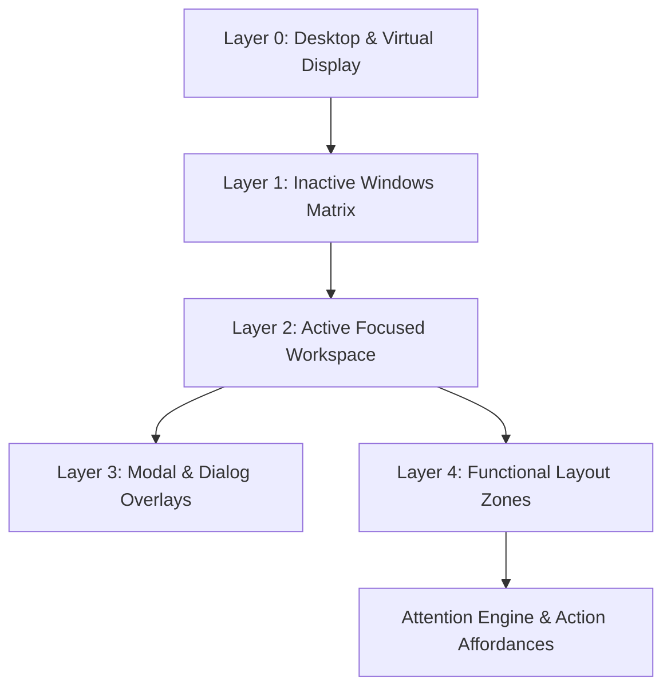

# WinTerM UI Perception & Physical Actions Guide

Autonomous desktop interaction on Windows is notoriously challenging for AI agents. Windows applications do not share a single GUI framework; they run across legacy Win32, WPF, modern UWP/WinUI3, and GPU-rendered Chromium/Electron engines. 

WinTerM bridges this gap by providing a deterministic perception-action loop that guarantees safety, accuracy, and zero external binary dependencies.

---

## 1. The 3 Classes of Windows Applications

When an AI agent targets a window, WinTerM automatically determines the correct perceptual and interaction strategy:

| Class | Application Types | GUI Framework | How WinTerM Perceives | How WinTerM Interacts |
| :--- | :--- | :--- | :--- | :--- |
| **Class A** | Task Manager, Notepad, File Explorer, System Settings | Win32, WPF, UWP / WinUI3 | Native UIAutomation tree (`winterm ui inspect`) | Semantic patterns (`InvokePattern`, `ValuePattern`), targeted HWND clicks |
| **Class B** | Google Chrome, VS Code, Slack, Teams, Discord, Spotify | Chromium, Electron, CEF | **WinRT Native OCR** (`winterm ui ocr`) + **Set-of-Mark** (`winterm ui som`) | Standard keyboard shortcuts (`Ctrl+L`, `Ctrl+P`), smart cascading clicks |
| **Class C** | Games, CAD software, media players, terminal canvases | DirectX, OpenGL, Vulkan, Direct2D | Window-scoped screen capture (`winterm screen capture`) | Window-relative offset coordinates, hardware `SendInput` |

---

## 2. The Eyes: Hardware-Accelerated Perception

### I. Zero-Dependency WinRT Native OCR
Traditional AI automation requires installing heavy third-party OCR engines like Tesseract, OpenCV, or external web APIs. 
WinTerM directly interfaces with Windows' built-in `Windows.Media.Ocr` WinRT subsystem:
- **Zero Dependencies**: Requires no Python packages, no C++ compilation, and no cloud API calls.
- **Hardware Accelerated**: Uses GPU DirectWrite rasterization.
- **DPI Aware**: Automatically scales bounding boxes according to monitor DPI.
- **Full Text Line & Word Coordinates**: Returns exact pixel bounding boxes for every detected word.

```powershell
# Extract all text visible in a window
winterm ui ocr <HWND>
```

### II. Set-of-Mark (SoM) Visual Grounding
For multimodal vision models (e.g. Gemini 1.5 Pro, Claude 3.5 Sonnet, GPT-4o), text coordinates can be abstract. WinTerM generates **Set-of-Mark (SoM)** badge overlays:
1. Enumerates interactive controls via UIAutomation.
2. Falls back to WinRT OCR word bounding boxes if the UIAutomation tree is shallow (Electron/Chromium).
3. Renders high-contrast, numbered badge overlays (`[1]`, `[2]`, `[3]...`) on the target window image.
4. Allows the vision model to simply output `"Click badge [3]"` to trigger precise execution.

```powershell
winterm ui som <HWND> "annotated_screenshot.png"
```


### III. Cognitive Screen Mental Map & Layered Spatial Attention
To prevent the agent from suffering from tunnel vision or lost focus during multi-step desktop workflows, WinTerM maintains an active **Screen Mental Map**:
- **Layered Spatial Stack**: Maps the desktop from Layer 0 (`Desktop Display` & DPI scaling) through Layer 1 (`Inactive Windows`), Layer 2 (`Active Foreground Workspace`), Layer 3 (`Modals & Security Prompts`), and Layer 4 (`Functional Zones`: `HEADER`, `NAVIGATION`, `CONTENT`, `SIDEBAR`, `FOOTER`).
- **Action Affordances Engine**: Fuses UIAutomation controls and OCR tokens into scored, actionable targets (`[CLICK]`, `[TYPE]`, `[SCROLL]`, `[HOVER]`) categorized by functional zone and execution priority (`CRITICAL`, `HIGH`, `NORMAL`, `LOW`).
- **Target Locking**: Windows resolved once by title are locked by numeric `HWND` to maintain deterministic focus even when title bars change.


### IV. Perceptual Change Verification (`wait-change`)
To prevent race conditions where an agent clicks before a page or modal finishes loading:
- WinTerM computes rolling visual hashes of the window canvas.
- Returns immediately when the hash changes and stabilizes.
- Eliminates brittle `sleep()` calls across varying hardware speeds.

```powershell
winterm ui wait-change <HWND> --timeout 5000
```

---

## 3. The Hands: Deterministic Physical Actions

### I. Verified Foreground Locking (`ForceForegroundVerified`)
In Windows, calling `SetForegroundWindow` from a background process or service is often blocked by the OS lock. WinTerM resolves this deterministically:
1. Attaches to the active interactive desktop via `OpenInputDesktop`.
2. Restores minimized windows (`ShowWindow(hWnd, SW_RESTORE)`).
3. Temporarily elevates the target window to `HWND_TOPMOST` so it rises above covering windows.
4. Simulates a zero-impact `Alt` key event to unlock Windows' foreground lock.
5. Verifies that `GetForegroundWindow() == target_hwnd` before permitting any keyboard or mouse input.

### II. Window-Contained Coordinate Clicks (`ClickInWindow`)
Blind screen clicking is hazardous: if another window opens or a notification appears, clicks can hit unintended targets. WinTerM enforces strict containment:
- Validates coordinates against `GetWindowRect`.
- Invokes `WindowFromPoint` and `IsChild` to verify that the click will strike the target window or its children.
- If an overlapping window obstructs the target, the click is refused.

### III. Hardware-Level Unicode Input (`SendInput`)
Legacy automation libraries rely on `keybd_event(0, c, KEYEVENTF_UNICODE, 0)`, which is undefined behavior in modern Windows and causes modern WinUI3 applications (such as the Windows 11 Notepad) to crash.
WinTerM uses native Win32 `SendInput` with proper `INPUT_KEYBOARD` structures and thread desktop synchronization, ensuring safe Unicode typing across all Windows apps.

---

## 4. Cognitive Screen Mental Map & Layered Spatial Attention

Rather than treating the screen as a disconnected grid of pixels or a chaotic dump of OCR text lines, WinTerM constructs and maintains a structured, persistent **Screen Mental Map** (`winterm_screen_mental_map`):



### I. Multi-Layer Spatial Partitioning
1. **Layer 0 (Desktop Canvas)**: Monitors virtual display metrics, screen boundaries, resolution, and DPI scale factors.
2. **Layer 1 (Inactive Windows Matrix)**: Tracks background windows, handles, minimize/restore states, and spatial bounding boxes without disturbing foreground focus.
3. **Layer 2 (Active Focused Workspace)**: The primary application window under the agent's control.
4. **Layer 3 (Modal & Dialog Overlays)**: Detects popups, confirmation prompts, alerts, and credential dialogs that demand immediate priority attention.
5. **Layer 4 (Functional Zones)**: Heuristically segments the active window geometry:
   - **`HEADER`** (Top 12%): Title bars, window controls, tab strips.
   - **`NAVIGATION`** (Next 12%): Omniboxes, URL bars, toolbars, breadcrumbs.
   - **`CONTENT`** (Central Canvas): Main documents, web views, feeds, work areas.
   - **`SIDEBAR`** (Outer 18%): Left/right navigation rails, file trees, inspectors.
   - **`FOOTER`** (Bottom 7%): Status bars, pagination, zoom controls.

### II. Semantic Role Deduction & Attention Steering
WinTerM fuses UIAutomation properties with WinRT OCR text to infer semantic roles:
- **`BUTTON`**: Interactive triggers (`Submit`, `Apply`, `Cancel`, `Save`).
- **`SEARCH_BOX`**: Inputs with search, query, or find keywords.
- **`INPUT`**: Text fields, form inputs, editable controls.
- **`TAB`**: View switchers, page tabs, document tabs.
- **`LINK`**: Navigational hyperlinks and web references.
- **`MENU_ITEM`**: Context and application menu options.

The **Attention Engine** derives prioritized **Action Affordances** (`CLICK`, `TYPE`, `SCROLL`) so LLM agents know precisely what high-value operations are available next on the screen, completely eliminating blind guessing.

### III. Perceptual State Diffing (`diff()`)
Agents can compare mental maps across action cycles (`map.diff(previous_map)`). The diff engine immediately isolates:
- Appeared elements (e.g. search suggestions, dropdown items, toast notifications).
- Disappeared elements (e.g. dismissed spinners, closed modals).
- Window title changes (e.g. page navigation, document state mutation).

---

## 5. Smarter & Safer Mouse and Keyboard Operations

### I. Anti-Bot Natural Mouse Movement (Cubic Bezier Interpolation)
Instantaneous cursor teleports (`SetCursorPos(x, y)`) trigger anti-automation heuristics on modern web and desktop apps. WinTerM's `MoveSmooth`:
- Interpolates trajectories using cubic Bezier curves with randomized control point offsets.
- Injects micro-variations in speed and position to mimic natural human cursor travel.
- Safely glides to target coordinates before clicking.

### II. Element Hovering (`HoverInWindow`)
Dynamic websites and desktop apps often reveal critical menus, action icons, or tooltips only on hover:
- `winterm ui hover` positions the cursor cleanly over an element (via UIA query or OCR word box) or relative coordinates.
- Dwells for a configurable duration (`dwell_ms`) to allow hover animations and popup menus to render.
- Validates window containment via `WindowFromPoint` before hovering.

### III. Calibrated Viewport Scrolling (`scroll_into_view`)
Instead of issuing blind mouse wheel scrolls:
- `winterm ui scroll-to` calculates the exact vertical delta between an off-screen element and the viewport center.
- Issues the exact number of mouse wheel ticks (calibrated to ~60–80 pixels per tick).
- Returns confirmation when the target is centered in view.

### IV. Focus-Verified Typing with Auto-Clear (`type_with_clear`)
When entering new queries or form values, residual placeholder text or previous search queries often causes corruption:
- `winterm input type-clear` executes a synchronized `Ctrl+A` followed by `Backspace`.
- Safely enters new replacement text via Unicode `SendInput`.
- Prevents typing leakage into inactive background windows.
